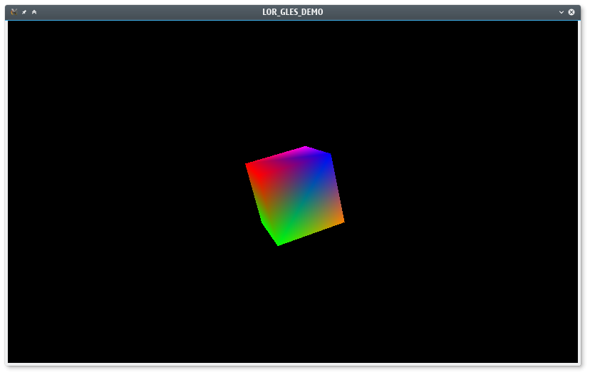

# gles_linux

### Dependency

* SDL2
```
  sudo apt-get install libsdl2-dev
```
* GLES
```
make sure <GLES> header files are present at /usr/include
```

A simple program that demostrates GLES works on a Linux OS



